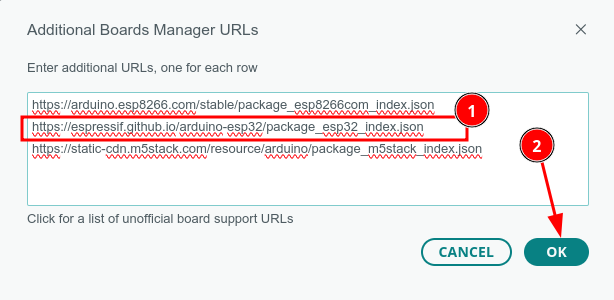
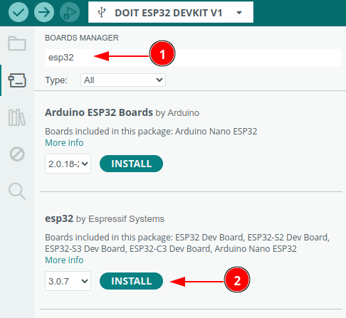

# Konfigurasi ESP32 DoiT Devkit V1

Untuk melakukan konfigurasi ESP32 di Arduino IDE, ikuti langkah-langkah berikut:

### 1. Instal Arduino IDE

Jika belum, unduh dan instal Arduino IDE dari situs resmi Arduino.

### 2. Tambahkan URL Board ESP32

1. Buka Arduino IDE.
2. Pergi ke **File** > **Preferences**.
3. Klik Additional Board manager
 
5. Di bagian "Additional Board Manager URLs", tambahkan URL berikut: ``` https://dl.espressif.com/dl/package_esp32_index.json```
6. Jika sudah ada URL lain, pisahkan dengan koma.


### 3. Instal Board ESP32

1. Buka **Tools** > **Board** > **Boards Manager**.


2. Cari "ESP32" di kolom pencarian.

3. Temukan "esp32 by Espressif Systems" dan klik **Install**.


### 4. Pilih Board ESP32

Setelah instalasi selesai, pergi ke **Tools** > **Board**.
- Pilih model board ESP32 yang sesuai dengan yang kamu gunakan (misalnya, **ESP32 Dev Module** atau **DOIT ESP32 Devkit V1**).

### 5. Pilih Port

- Sambungkan ESP32 ke komputer melalui kabel USB.
- Pergi ke **Tools** > **Port** dan pilih port yang terhubung dengan ESP32.

### 6. Buka Contoh Program

- Buka **File** > **Examples** > **ESP32**.
- Pilih contoh yang ingin kamu gunakan, seperti **Blinky** 

### 7. Unggah Kode ke ESP32

- Setelah mengedit kode (jika perlu), klik tombol **Upload** (panah ke kanan) di bagian atas Arduino IDE.
- Tunggu hingga proses upload selesai.

### 8. Buka Serial Monitor (Jika Diperlukan)

Jika program menggunakan komunikasi serial, buka Serial Monitor dengan mengklik ikon kaca pembesar di kanan atas, atau pergi ke **Tools** > **Serial Monitor**.

Dengan langkah-langkah ini, kamu dapat mengonfigurasi dan mulai menggunakan ESP32 di Arduino IDE!

# Prosedur Download

Berikut adalah prosedur yang harus diikuti. Hal ini berguna terutama jika Anda mengalami masalah dengan mode auto-upload atau ingin mem-flash secara manual:

1. Persiapan:
   - Pastikan Anda telah menghubungkan ESP32 ke komputer menggunakan kabel USB.
   - Pastikan bahwa perangkat lunak pengembangan seperti Arduino IDE atau esptool.py telah terinstal dan Anda telah memilih board ESP32 yang benar di dalam IDE.

2. Pilih Port yang Tepat:
   - Di Arduino IDE atau perangkat lunak lain yang Anda gunakan, pilih port COM yang sesuai dengan ESP32 Anda.

3. Memasukkan ke Mode Bootloader:
   - **Tekan dan Tahan Tombol BOOT**: Ini adalah tombol yang biasanya dipakai untuk masuk ke mode bootloader.
   - **Tekan Tekan Tombol EN (Reset)**: Sementara masih menahan tombol BOOT, tekan tombol EN. Ini akan mereset ESP32 Anda.
   - **Lepaskan Tombol EN**: Lepaskan tombol EN (Reset) sementara masih menekan tombol BOOT. Ini akan membuat ESP32 memasuki mode bootloader.
   - **Lepaskan Tombol BOOT**: Setelah beberapa detik, lepaskan tombol BOOT.

4. Unggah Program:
   - Lakukan perintah upload pada perangkat lunak pengembangan Anda (misalnya, klik ikon Upload di Arduino IDE).
   - Tunggu hingga proses upload selesai. Anda akan melihat pesan sukses jika upload program berhasil.

5. Menjalankan Program:
   - Setelah program berhasil diunggah, tekan tombol EN (Reset) sekali lagi untuk menjalankan program yang baru saja Anda download ke ESP32.

## 💡NOTE:
- Note: LED pada chip ESP32 hanya indikator komunikasi, bukan indikator daya maupun User LED; tidak menyala jika belum ada program yang akses serial.
- Driver Serial chip menggunakan CP2102


