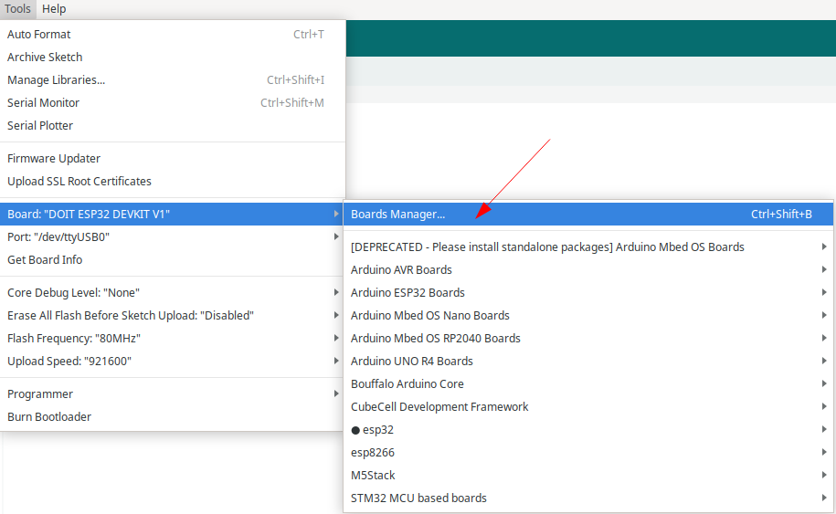

# Wiring ESP32 Lora RA-02

Saya akan membuatkan tabel koneksi wiring antara ESP32 DOIT DevKit dan modul LoRa.

| ESP32 DOIT | LoRa Module | Fungsi                  |
| ---------- | ----------- | ----------------------- |
| 3.3V       | VCC/3.3V    | Power                   |
| GND        | GND         | Ground                  |
| GPIO 18    | SCK         | Clock                   |
| GPIO 19    | MISO        | Data dari LoRa ke ESP32 |
| GPIO 23    | MOSI        | Data dari ESP32 ke LoRa |
| GPIO 5     | NSS/SS      | Chip Select             |
| GPIO 14    | RST         | Reset                   |
| GPIO 26    | DIO0        | Interrupt               |

Beberapa catatan penting:
1. Pastikan menggunakan power 3.3V, bukan 5V karena modul LoRa bekerja pada tegangan 3.3V
2. Koneksi ini menggunakan protokol SPI (Serial Peripheral Interface)
3. Pin-pin yang disebutkan di atas adalah standar yang umum digunakan, namun bisa dikonfigurasi ulang sesuai kebutuhan
4. Pastikan semua koneksi terpasang dengan benar untuk menghindari kerusakan pada modul


## Bagian Sender

```c++
//lora library by Sandeep Mistry
// lora Sender 915MHz V2.1-1.6
// Modified by HwThinker
#include <SPI.h>
#include <LoRa.h>
#include <Wire.h>  // Only needed for Arduino 1.6.5 and earlier

#define SCK     18   
#define MISO    19   
#define MOSI    23   
#define SS      5   
#define RST     14  
#define DI0     26   
#define BAND    433E6

// #define LED_BUILTIN 25

int counter = 0;
int state = 0;


void setup() {
  // pinMode(LED_BUILTIN, OUTPUT);

  Serial.begin(9600);
  while (!Serial); //If just the the basic function, must connect to a computer

  SPI.begin(SCK, MISO, MOSI, SS);
  LoRa.setPins(SS, RST, DI0);
  Serial.println("LoRa Sender");

  if (!LoRa.begin(BAND)) {
    Serial.println("Starting LoRa failed!");
    while (1);
  }
  Serial.println("LoRa Initial OK!");
}

void loop() {

  Serial.print("Sending packet: ");
  Serial.println(counter);

  // send packet
  LoRa.beginPacket();
  LoRa.print("hello ");
  LoRa.print(counter);
  LoRa.endPacket();

  counter++;
  delay(2200);
  //  digitalWrite(LED_BUILTIN, (state) ? HIGH : LOW);
  //  state = !state;
  // digitalWrite(LED_BUILTIN, !digitalRead(LED_BUILTIN));

}
```

## 

## Bagian Receiver

```c++

#include <Arduino.h>
#include <SPI.h>
#include <LoRa.h>

#define SCK     18    
#define MISO    19   
#define MOSI    23  
#define SS      5   
#define RST     14  
#define DI0     26   
#define BAND    433E6

// Pin LED
// #define LED_PIN 25

void setup()
{
  // Konfigurasi pin LED
  // pinMode(LED_PIN, OUTPUT);
  // digitalWrite(LED_PIN, LOW); // Mulai dengan LED mati

  Serial.begin(9600);
  while (!Serial)
    ;

  // Konfigurasi pin LoRa
  LoRa.setPins(SS, RST, DI0);

  // Inisialisasi LoRa
  if (!LoRa.begin(BAND))
  {
    Serial.println("Gagal menginisialisasi LoRa");
    while (1)
      ;
  }
  Serial.println("LoRa inisialisasi berhasil!");
}

void loop()
{
  // Cek apakah ada paket yang diterima
  int packetSize = LoRa.parsePacket();
  if (packetSize)
  {
    String receivedMessage = "";

    while (LoRa.available())
    {
      receivedMessage += (char)LoRa.read();
    }

    Serial.print("Pesan diterima: ");
    Serial.println(receivedMessage);
    // digitalWrite(LED_PIN,!digitalRead(LED_PIN));
  }
}

```

## 

# Konfigurasi ESP32 DoiT Devkit V1

Untuk melakukan konfigurasi ESP32 di Arduino IDE, ikuti langkah-langkah berikut:

### 1. Instal Arduino IDE

Jika belum, unduh dan instal Arduino IDE dari situs resmi Arduino.

### 2. Tambahkan URL Board ESP32

1. Buka Arduino IDE.
2. Pergi ke **File** > **Preferences**.
3. Klik Additional Board manager
 
5. Di bagian "Additional Board Manager URLs", tambahkan URL berikut: ``` https://dl.espressif.com/dl/package_esp32_index.json```
6. Jika sudah ada URL lain, pisahkan dengan koma.


### 3. Instal Board ESP32

1. Buka **Tools** > **Board** > **Boards Manager**.



2. Cari "ESP32" di kolom pencarian.

3. Temukan "esp32 by Espressif Systems" dan klik **Install**.


### 4. Pilih Board ESP32

Setelah instalasi selesai, pergi ke **Tools** > **Board**.
- Pilih model board ESP32 yang sesuai dengan yang kamu gunakan (misalnya, **ESP32 Dev Module** atau **DOIT ESP32 Devkit V1**).

### 5. Pilih Port

- Sambungkan ESP32 ke komputer melalui kabel USB.
- Pergi ke **Tools** > **Port** dan pilih port yang terhubung dengan ESP32.

### 6. Buka Contoh Program

- Buka **File** > **Examples** > **ESP32**.
- Pilih contoh yang ingin kamu gunakan, seperti **Blinky** 

### 7. Unggah Kode ke ESP32

- Setelah mengedit kode (jika perlu), klik tombol **Upload** (panah ke kanan) di bagian atas Arduino IDE.
- Tunggu hingga proses upload selesai.

### 8. Buka Serial Monitor (Jika Diperlukan)

Jika program menggunakan komunikasi serial, buka Serial Monitor dengan mengklik ikon kaca pembesar di kanan atas, atau pergi ke **Tools** > **Serial Monitor**.

Dengan langkah-langkah ini, kamu dapat mengonfigurasi dan mulai menggunakan ESP32 di Arduino IDE!

# Prosedur Download

Berikut adalah prosedur yang harus diikuti. Hal ini berguna terutama jika Anda mengalami masalah dengan mode auto-upload atau ingin mem-flash secara manual:

1. Persiapan:
   - Pastikan Anda telah menghubungkan ESP32 ke komputer menggunakan kabel USB.
   - Pastikan bahwa perangkat lunak pengembangan seperti Arduino IDE atau esptool.py telah terinstal dan Anda telah memilih board ESP32 yang benar di dalam IDE.

2. Pilih Port yang Tepat:
   - Di Arduino IDE atau perangkat lunak lain yang Anda gunakan, pilih port COM yang sesuai dengan ESP32 Anda.

3. Memasukkan ke Mode Bootloader:
   - **Tekan dan Tahan Tombol BOOT**: Ini adalah tombol yang biasanya dipakai untuk masuk ke mode bootloader.
   - **Tekan Tekan Tombol EN (Reset)**: Sementara masih menahan tombol BOOT, tekan tombol EN. Ini akan mereset ESP32 Anda.
   - **Lepaskan Tombol EN**: Lepaskan tombol EN (Reset) sementara masih menekan tombol BOOT. Ini akan membuat ESP32 memasuki mode bootloader.
   - **Lepaskan Tombol BOOT**: Setelah beberapa detik, lepaskan tombol BOOT.

4. Unggah Program:
   - Lakukan perintah upload pada perangkat lunak pengembangan Anda (misalnya, klik ikon Upload di Arduino IDE).
   - Tunggu hingga proses upload selesai. Anda akan melihat pesan sukses jika upload program berhasil.

5. Menjalankan Program:
   - Setelah program berhasil diunggah, tekan tombol EN (Reset) sekali lagi untuk menjalankan program yang baru saja Anda download ke ESP32.

## 💡NOTE:

- Note: LED pada chip ESP32 hanya indikator komunikasi, bukan indikator daya maupun User LED; tidak menyala jika belum ada program yang akses serial.
- Driver Serial chip menggunakan CP2102


